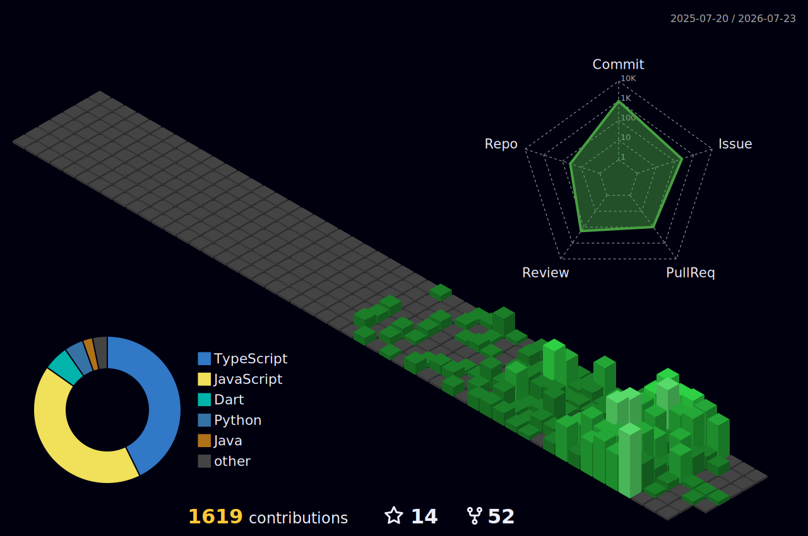

# 💫 About Me:
🚀 Second-year Computer Engineering student passionate about coding, problem-solving, and building real-world projects. Skilled in C, Python, Java, HTML, CSS, JavaScript, and exploring game development with Godot. I enjoy learning new technologies, creating practical applications, and improving my skills through hands-on projects and continuous experimentation.

  

# 🌐 Socials:

   

# 💻 Tech Stack:
                                                                 

 

  

# 📊 GitHub Stats

<table>
<tr>
<td width="50%">

</td>
<td width="50%">

</td>
</tr>
</table>

## 🏆 GitHub Trophies

---

---

